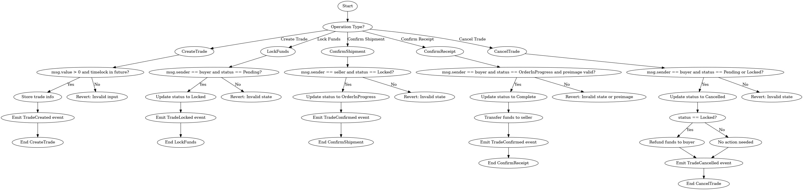
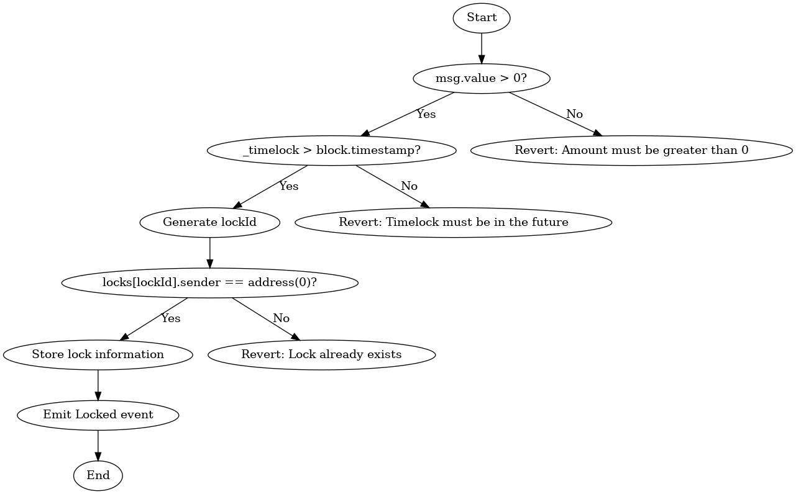
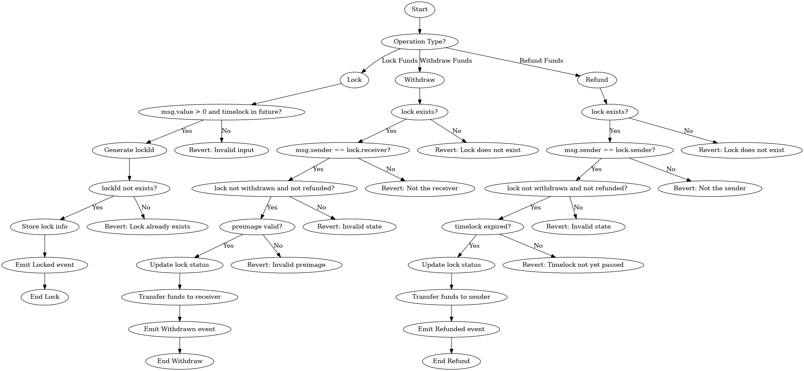
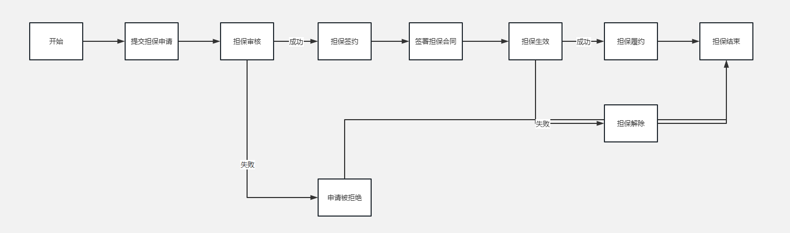
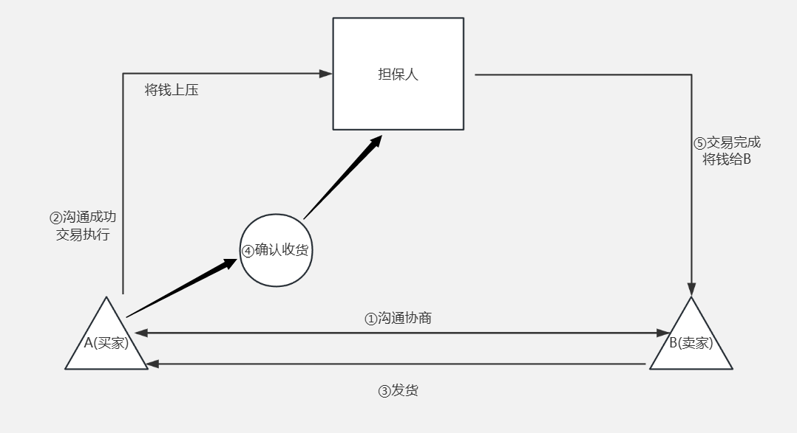

<div style="display: flex; flex-direction: row;">
    
    
    
    
</div>
//计划添加更新EIP7690 EIP7690

# TPlanet

#### 中文 | [English](https://github.com/admi-n/TPlanet/blob/main/README_EN.md)

## 项目介绍

以智能合约来作为"中间人"构建担保系统。以实现C2C交易系统。

以智能合约构建绝对信任的担保系统Dapp，通过区块链技术为买卖双方提供基于区块链的稳定安全担保服务。

### 项目背景

...


## Dapp的主要功能

#### 平台架构


```
前端 (React)                             后端 (Solidity)
-------------------------------------------------------
用户A (卖家)   ->      智能合约      <-    用户B (买家)
创建交易               交易创建            锁定资金
确认发货       ->      交易确认      ->     确认收货
```


#### 技术架构

##### 智能合约架构

C2CPlatform(Main)



HashLock



整体HashLock构架



### 与传统担保系统的区别

传统以中间人作为担保的系统流程



传统以信任中间人为担保的系统流程



以智能合约实现担保流程

