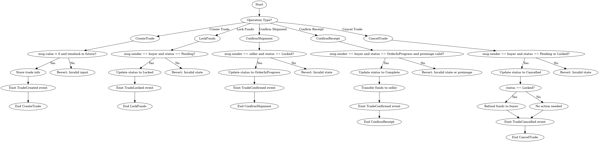
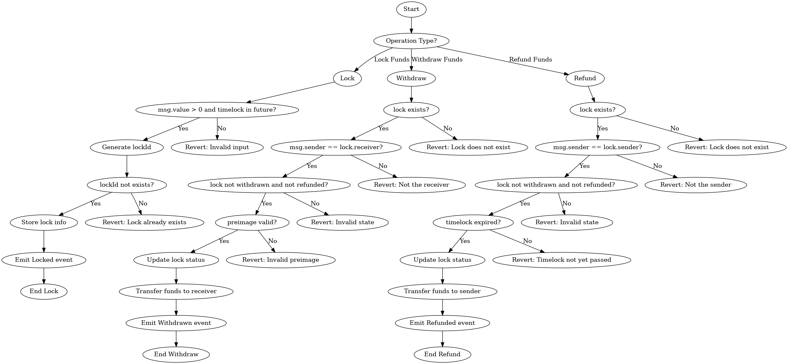

<div style="display: flex; flex-direction: row;">
    
    
    
    
</div>

# TPlanet

#### [中文](https://github.com/admi-n/TPlanet/blob/main/README.md) | English

### Project Introduction

Use smart contracts as "middlemen" to build a guarantee system to realize the C2C transaction system.

The Dapp, a guarantee system with absolute trust, is built with smart contracts, and provides stable and secure guarantee services based on blockchain for buyers and sellers through blockchain technology.


### Background of the project

...


## Main function

#### Platform Architecture

```
Front end (React)                                Back end (Solidity)
----------------------------------------------------------------
UserA (seller)       ->    Smart Contracts    <-     UserB (buyer)
CreateTrade              Tradecreation            Locking Funds
confirmShipment   ->     confirmReceipt    ->     ConfirmReceipt
```

#### technical architecture

##### Smart Contract Architecture

C2CPlatform(Main)



HashLock


整体HashLock构架



#### Flowchart Demo

.....